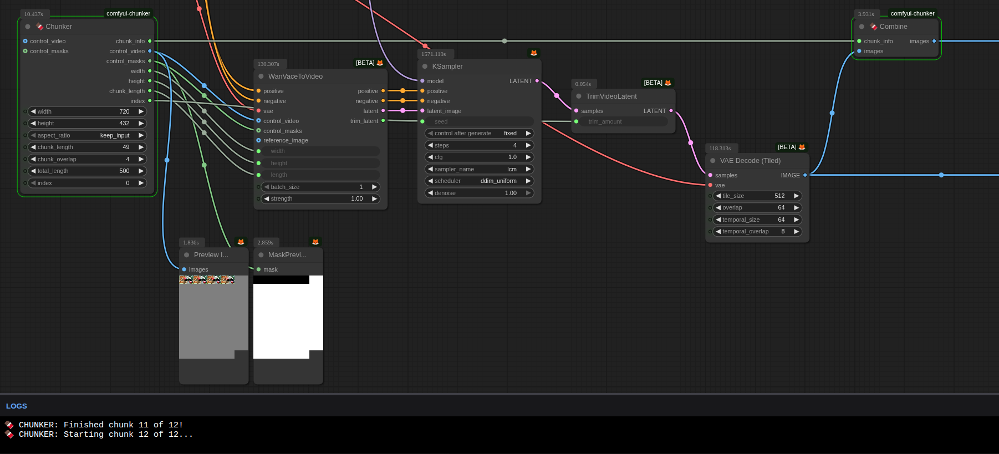

# comfyui-chunker

Create longer Wan videos by automatically taking the last few frames of the last generated video and feeding it into the first few frames of the next generation. 

- RAM: Chunker saves previous generation in an mp4 file, this means less ram is used
- 

[workflow](./workflows/chunker-wan21vace-t2v.json)

## Samples

https://github.com/user-attachments/assets/587530f3-1752-46dd-9156-9343fa2ab16d

## Nodes

### 🍫 Divide

### 🍫 Combine

### 🍫 VACE To First Last

## prep for release
- remove extra nodes
- Tidy unused code
- revise readme and samples
- finalise a few workflows with animated preview
  - chunker-t2v
  - chunker-sam3
  - chunker-vace
  - chunker-fl
- test everything
- trash this repo make a new one with one commit
- publish to comfyui-manager via PR

## Future / Ideas

- Make compaitable with non wan, eg sam2
- Chunker Composer idea
  - for i2v
  - takes a set of images and masks and generates a control_video and masks for Chunker to consume
  - allows the user to compose control_video and masks with text string
  - example sequence: `1,fill,2`
    - put 1st image as first image
    - fill middle of chunk with blank panels 
    - put 2nd image as last image
  - it needs to discover or be told the chunk length and overlap settings and use them in the calculations
- size selector ui idea
  - Remove (or hide) "width" and "height" and "aspect" inputs?
  - Remove "Swap Width / Height" button
  - add a new button with called "Size selector" or "Resize options..."
  - clicking the button shows a new dialog box
    - for selecting the width and height to some known values
    - for swapping the width and height
    - for setting up a mega pixel value?
      - maybe just a megapixel value instead of width/height, etc?

## Donations

- ??

## Known bugs

- VACE sometimes rejects the size (esp. some smaller sizes)
- When using Load Image with mask connected, but no mask drawn, then Chunker throws error
- KSampler with seed connected to values causes Combine to error
- Can't have 2x divide+combine in same workflow because execution order means out of vram error is likely